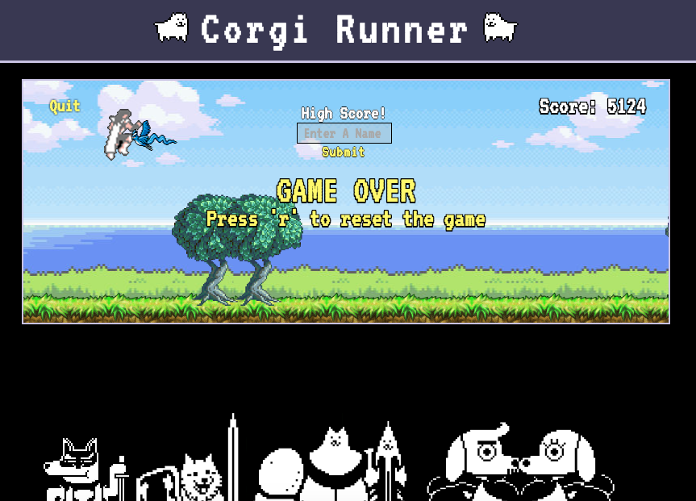

# Corgi Runner


[live](http://www.direcorgi.com/runner/)

Corgi Runner is an infinite run game inspired by the likes of T-rex runner,
Temple Run, and Subway Surfers. The goal of the game is to survive as long as possible
and get the highest score.

## Instructions
Your Corgi has escaped! Chase after him! Choose a difficulty level. Avoid obstacles (trees and birds) by pressing the **space** key to jump.

## Technologies
- JavaScript
- HTML5 Canvas

## Features and Implementation
All features in this game were implemented using native JavaScript DOM manipulation and, HTML5 canvas. No additional libraries were used.

### Parallax Background
The Parallax background effect was created by having multiple canvas layers.  

```JavaScript
class Background {
  constructor(ctx, image, posY, imageLength, speed) {
    ...
  }
  ...
}

createBackground(backgroundCtx, foregroundCtx) {
  const backgroundImage = new Image();
  backgroundImage.src = './assets/images/scrolling-background.jpg';
  this.background = new Background(backgroundCtx, backgroundImage, -35, 1422, 0.8);

  const foregroundImage = new Image();
  foregroundImage.src = './assets/images/foreground-grass.png';
  this.foreground = new Background(foregroundCtx, foregroundImage, 250, 720, 6);
}
```
Two different instances of the Background class are created in the main game class, and are each given a different image and a separate canvas context. These will scroll at different speeds, creating the parallax effect. The degree of this effect can be adjusted directly in the game class.

### Difficulty Settings
The difficulty settings change the random obstacle generation in the game. This is achieved by having a difficulty object that stores all of these settings, and will readjust the game based on the player selection.

```JavaScript
const Difficulty = {
  'hard': {
    birds: true,
    multiplier: 7,
    maxTrees: 3,
    maxObstacles: 10,
  },
  'medium': {
    birds: false,
    multiplier: 3,
    maxTrees: 3,
    maxObstacles: 7,
  },
  'easy': {
    birds: false,
    multiplier: 1,
    maxTrees: 1,
    maxObstacles: 6,
  }
};
```
These settings are called on the ``game.start(difficulty)`` method. These settings can be tweaked as needed directly in the difficulty file.

### High Scores
Local high scores are saved in a score object. This score object will also try to write a cookie to the browser in order to save local high scores between sessions. The score object will check if there is a cookie with scores already present, and if there is it will use those saved high scores.

```JavaScript
const scoreCookie = Util.readCookie('localHighScores');
if (scoreCookie) {
  this.localHighScores = JSON.parse(scoreCookie);
} else {
  this.localHighScores = [
    [ 'dio', 15000 ],
    [ 'dio', 12000 ],
    [ 'dio', 8000 ],
    [ 'dio', 4000 ],
    [ 'dio', 1000 ]
  ];
}
```
On the live version there is a global high score that requires a backend database to store names and scores. This not a feature you will have if you download and play this game locally.

## Future Features
1. Add more difficulty settings (VERY HARD).
2. Create obstacles that move up and down and create beatable patterns around those.

#### Legal
Art and music assets used in this project are for educational purposes only.

Art and Music assets are property of [Tobi Fox](www.undertale.com/), [Nintendo](www.nintendo.com/), and [Nexon](maplestory.nexon.net/).
