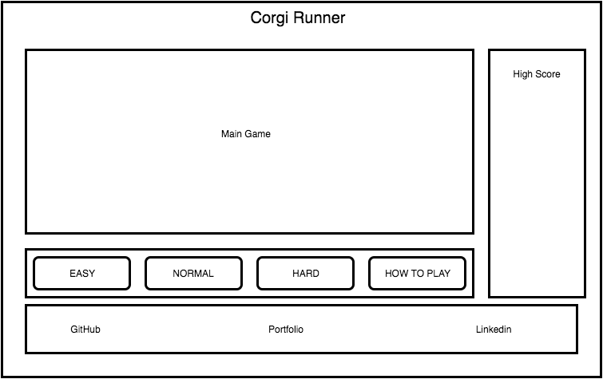

# Corgi Runner
Corgi Runner is an infinite run game inspired by games such as Google's t-rex runner and bit trip runner.

### Description
Your corgi saw a truck full of delicious sausages and started to chase it! Run after him and avoid the slew of obstacles in the way.

### Functionality
Users will be able to:
- [ ] Start, pause, and reset the game after they get game over.
- [ ] Choose a difficulty level that will change the patterns and frequency of obstacles.
- [ ] Scoring and saving high scores locally.
- [ ] Modal explaining the story and controls of the game
- [ ] Production README

### Wireframes
Corgi Runner will consist of a single page with the main game screen, a nav with difficulty icons and the modal button, and a footer with links to my Github, and Portfolio.  

### Technologies
This project will use the following technologies:
- Vanilla Javascript for game logic and jQuery for button inputs
- HTML5 Canvas for rendering and graphics
- Webpack to bundle and serve scripts
- Lightweight backend Firebase to keep track of high-scores

The following scripts will be needed:
- player.js to keep track of all jumping and collisions with the player object
- board.js to handle object rendering on the main game board
- obstacle.js this class will be the basis of all obstacles in the game
- random_obstacle.js this script be in charge of creating the right patterns of obstacles based on the difficulty level

### Timeline
**Day 1** Setup html and css to render all non-canvas objects properly. Setup player.js to properly render a player object that can jump when you press spacebar.

**Day 2** Create two types of obstacles, one that you must jump over and one that you must not jump to get under. Add a rotation that will change the sprite that is rendered randomly for these obstacles. Add collision between the player and the obstacles.

**Day 3** Add a scoring system and add the ability to save your high scores locally. Add random_obstacle.js to create beatable patterns of obstacles based on the selected difficulty level.

### Bonus Features
- [ ] Global high scores will be saved via a lite backend such as Firebase.
- [ ] Add more obstacle types such as moving ones that go up and down.
